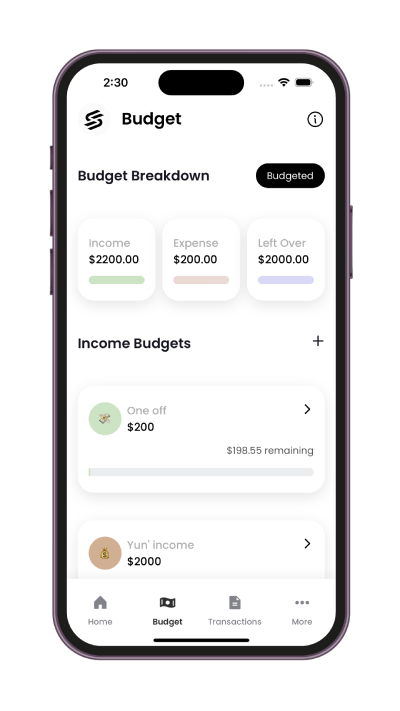

# Savr: Expense Tracking and Budgeting App

Savr is a cutting-edge fintech mobile application designed to revolutionize personal finance management. By combining advanced technology with user-centric design, Savr empowers individuals to take control of their finances effortlessly. Users can connect their bank accounts, track real-time transactions, set budgets, and monitor their spending—all in one intuitive and visually appealing platform.

---

## Features

### **Expense Tracking**

- Securely fetch real-time transactions from connected bank accounts using the Akahu API.
- Automatically categorize transactions into predefined categories like food, entertainment, and utilities.
- Edit transaction categories or create your own custom categories for a more personalized experience.

### **Budget Management**

- Create and set budgets for various categories, such as income, expenses, and savings.
- Track budget progress in real-time with visual indicators and summaries.
- Monitor remaining balances and adjust budgets as circumstances change.

### **User Authentication**

- Enjoy a secure and seamless sign-up and login process powered by Clerk.
- Ensure your financial data remains private and protected with industry-standard authentication practices.

---

## Tech Stack

Savr leverages modern frameworks and tools to deliver a powerful and reliable app:

- **Frontend**: React Native with Expo for multi-platform development and Tailwind CSS for styling.
- **Backend**: Supabase, an open-source alternative to Firebase, providing real-time database capabilities.
- **Banking Integration**: Akahu API for connecting to financial institutions and retrieving transaction data.
- **Authentication**: Clerk for secure user authentication and management.

### Home Screen

### Budget Screen

### Transaction Screen

### Merchants Screen

### Signin Screen

